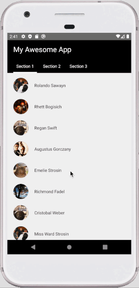

Here we're going to build an animated header that **disappears when the user scrolls down the list and reappears when the user scrolls back upwards.** Also, the header will have a **sticky bar** that will be there all the way around, no matter where the user is in the vertical list.



This is a pretty standard and commonly used effect in mobile apps.

Without further ado, let's start the tutorial:

## Container Component

Here we will go with a classic approach. Which is to **put the header component out of the scroll container and position it with `absolute` style property.**

This will cause an overlap between the header and scrollable content. So the `Animated.ScrollView` will need a:

```javascript:
contentContainerStyle={{paddingTop: this.state.headerHeight}}
```

Therefor we need to measure the `headerHeight` as well. For this to happen, we will pass an `onLayout` callback function to the header component and will call it inside `CollapsibleHeader` component later on:

```js
onHeaderLayout = (headerHeight) => {
  this.setState({
     headerHeight,
  });
};
// A bunch of code we don't need yet
render() {
  // A bunch of components and props again not needed yet...
  <CollapsibleHeader
  // A ton of props we don't care about yet...
  onLayout={this.onHeaderLayout}
  ..
  />
}
```

And to trace the scroll, we will use this function:

```js
onScroll={Animated.event(
  [{nativeEvent: {contentOffset: {y: this.scrollY}}}],
  {useNativeDriver: true},
)}
```

Which `scrollY` is an `Animated` value defined at the top of the container component:

```js
this.scrollY = new Animated.Value(0)
```

## Collapsible Header Component

Our `CollapsibleHeader` component will need to know about the scroll value to work. Therefore we will add this prop to the component which is in the container component:

```js
scrollY={this.scrollY}
```

### `onLayout` function

Remember the `onLayout` callback from the previous section? Here's where we're going to define the function itself and fetch the required values and eventually inform the parent about it:

```js
onLayout = ({
  nativeEvent: {
    layout: { y, height },
  },
}) => {
  this.setState({
    layoutHeight: height,
  })
  this.props.onLayout && this.props.onLayout(height)
}
```

First, this function will be passed as a prop to the wrapper `Animated.View` component. Which is used to navigate the animated transformation while scrolling the content.

Next, we're fetching the height of the header component and putting it in the state to use later for transformation.

### `diffClamp` function

Now one of the crucial steps of achieving our desired animated effect comes to play: The `diffClamp`.

To understand what does this `Animated` function does, let's start with clamping itself.

#### Clamping

> In computer graphics, **clamping** is the process of limiting a position to an area. In general, clamping is used to restrict a value to a given range.
> _Wikipedia_

The pseudocode for clamping is more intuitive to understand:

```c:
function clamp(x, min, max):
    if (x < min) then
        x = min
    else if (x > max) then
        x = max
    return x
```

In our case, `x` would be the `scrollY` value, obviously. But this simple clamping **is not enough**.

This would just limit the exact `scrollY` value. It would've been desirable if we only wanted to display the header on the top of the page. And then hide it when the user scrolls past the header height.

But what we want is to **reappear the header when the user drags downwards and goes up on the list.**

In a way, we can say **we don't care about the raw `scrollY` value. We care about how much it's changed compared to a moment ago.**

This is what `diffClamp` does for us. **This function internally subtracts the two continuous `scrollY` values and feeds them to the clamp function.** So this way, we will always have a value between `0` and `headerHeight` no matter where on the list.

#### How to calculate the `diffClamp`?

We will calculate the `clampedScroll` value in the `componentDidUpdate()`:

```js
componentDidUpdate() {
    const {scrollY, stickyHeaderHeight} = this.props;
    const {layoutHeight, clampedScroll} = this.state;

    if (stickyHeaderHeight && layoutHeight && !clampedScroll) {
      this.setState({
        clampedScroll: Animated.diffClamp(
          scrollY,
          0,
          layoutHeight - stickyHeaderHeight,
        ),
      });
    }
  }
```

So let's see what's going on here. Shall we?

We set the `min` value equal to `0`. Because we want the calculations to start at the top of the list when no motion is made yet. And **we stop the range when the user scrolls about the height of the header.** Since we want to display the sticky bar all the way around, **we're subtracting the height of the bar here.**

#### Fetch `stickyBarHeight` in the `CollpsibleHeader` component

To get the sticky bar height, we've got several solutions. The solution used here exposes the `setStickyHeight` method to the parent, and the parent passes it to the sticky bar component.

Then this function gets called in the `TabBar` component's `onLayout` function eventually and gives us the height. We will go over this in more detail in the next section.

_Another approach would be calling the `setStickyHeight` method in the `ComponentDidUpdate()` when the `stickyHeight` prop is available through the parent._

### Rendering the animated header

_Phew!_ And clamping is done! Let's move forward to actually using what we've calculated. Now we're in the `render` method finally!

**We're going to change the `translateY` value of the wrapper `View`. Meaning, Moving it upward and downward.**

To move it out of the view, we need negative `translateY` value equal to the `layoutHeight - stickyHeight`. And vice verca to display it again.

The relationship between the `clampedScroll` and the `translateY` is equal but reverse in direction.

So we just need to reverse the calculated clamped scroll value. Since we want to hide the header when the user scrolls down, (Thus the `scrollY` value increases). And we want to display the header as soon as the user scrolls up. (therefore decreasing the `scrollY` value).

And this is how it's done:

```js
const translateY =
  clampedScroll && layoutHeight && stickyHeight
    ? Animated.multiply(clampedScroll, -1)
    : 0
```

_Another approach would be using the `interpolate` method._

### Wrapping up

And that's it! **Now our animated value is generated and it's ready to be used.** All we need to do is to pass it in the `style` array, alongside the `onLayout` prop:

```js
return (
  <Animated.View
    style={[styles.container, { transform: [{ translateY }] }]}
    onLayout={this.onLayout}
  >
    {this.props.children}
  </Animated.View>
)
```

Also since we use the `absolute` positioning for the header component, we're going to use this container style:

```jsx
container: {
    position: 'absolute',
    top: 0,
    left: 0,
    right: 0,
    backgroundColor: 'black',
    zIndex: 10,
  },
```

## Sticky Bar Component

Now we're in the final step, which is writing the sticky bar component. This is an elementary component just to demonstrate the effect.
In our case, this component will be the child of `<CollapsibleHeader>` component. As such:

```js
<CollapsibleHeader
  ...
>
  <Text style={styles.sectionTitle}>My Awesome App</Text>
  <TabBar onLayout={this.onStickyHeaderLayout} />
</CollapsibleHeader>
```

As you see we only need to pass the `onLayout` callback function of the parent. Which is similar to the one we've used for the `CollapsibleHeader` component:

```js
onStickyHeaderLayout = stickyHeaderHeight => {
  this.setState({
    stickyHeaderHeight,
  })
  this.header?.current?.setStickyHeight(stickyHeaderHeight)
}
```

In the second section, we've talked about the `setStickyHeight` function of the `<CollapsibleHeader>` and why we need it.

To have the height, the main wrapper of the `<TabBar>` component needs an `onLayout` function which follows the same patterns:

```js
onViewLayout = ({
  nativeEvent: {
    layout: { height, y },
  },
}) => {
  const { onLayout } = this.props
  onLayout && onLayout(height, y)
}
```

## And finally...

We're good. We should have a smooth appearing/disappearing animation effect on our header component using the `Animated` API.

In the next post, we will create the same effect but with a set of whole new tools! We will reqrite the components as function components. We will some custom hooks. And above all, **we will use the new and fancy Reanimated V2!**. Also this time we will use the `interpolate` approach.

So if you've liked this one and are interested in the above topics, make sure to subscribe to my newsletter down here to be notified when the next post is shipped!
